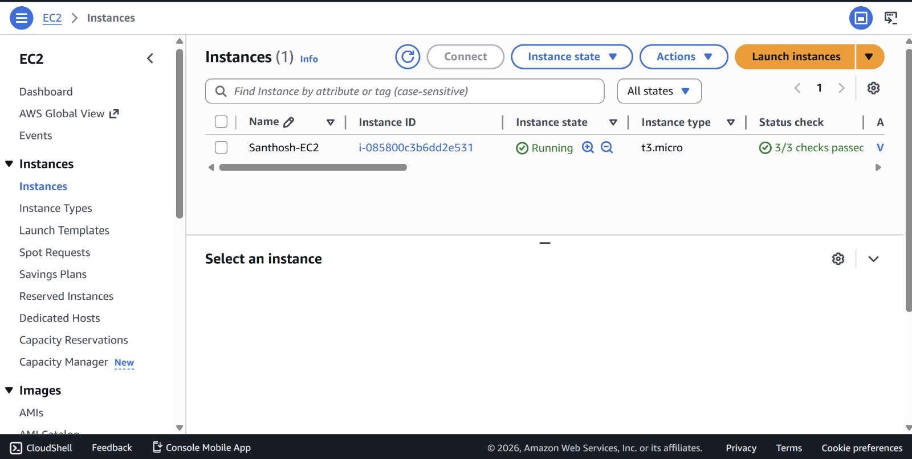
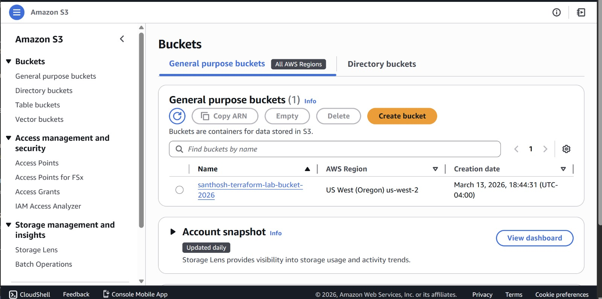
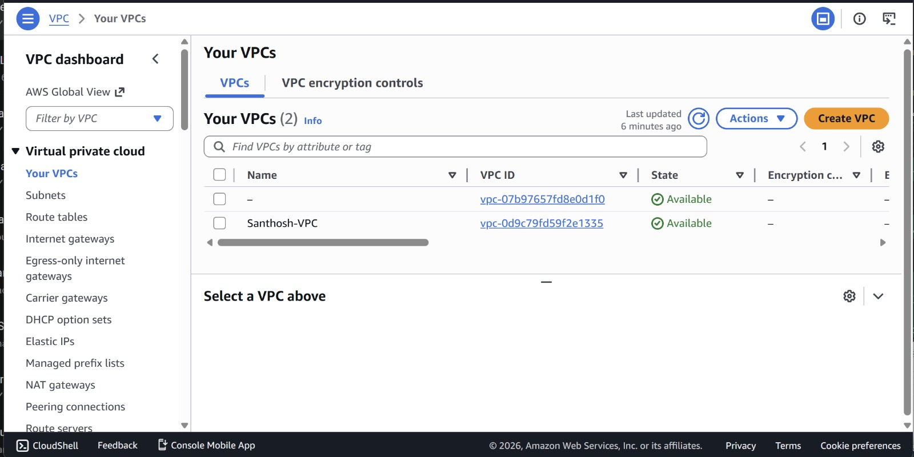
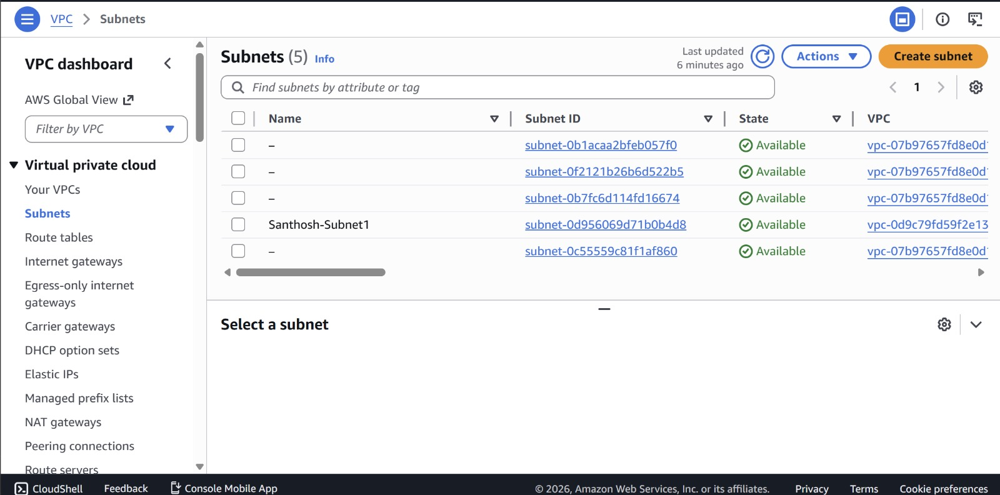

# Terraform Beginner Lab
**Santhoshkumar Chandrasekar**

---

## Overview

This lab demonstrates the fundamentals of Terraform by provisioning real AWS infrastructure using Infrastructure as Code (IaC). The configuration deploys an EC2 instance, an S3 bucket, a VPC, and a Subnet — all in the `us-west-2` (Oregon) region — and then cleanly destroys them using `terraform destroy`.

---

## What I Did Differently from the Professor's Version

The base lab provided by the professor was a starting point. I made the following intentional changes to demonstrate independent understanding of Terraform:

| Feature | Professor's Version | My Version |
|---|---|---|
| AWS Region | `us-east-1` (N. Virginia) | `us-west-2` (Oregon) |
| Instance Type | `t2.micro` | `t3.micro` (newer generation, better performance) |
| AMI | Amazon Linux 2 for us-east-1 | Amazon Linux 2023 for us-west-2 |
| S3 Bucket | ❌ Not included | ✅ Added `santhosh-terraform-lab-bucket-2026` |
| Resource Tags | Basic or none | Full tags on every resource: `Name`, `Environment`, `Project`, `Owner` |

The S3 bucket addition required understanding how Terraform manages multiple resource types in a single configuration and how AWS globally unique bucket naming works. The comprehensive tagging strategy reflects real-world IaC practices where every resource is traceable to an owner and project.

---

## Prerequisites

- AWS account with access keys (Access Key ID + Secret Access Key)
- Terraform installed
- Windows PowerShell (or terminal on macOS/Linux)

---

## Setup Instructions

### 1. Install Terraform (Windows)

Open PowerShell as Administrator and run:

```powershell
winget install HashiCorp.Terraform
```

Close and reopen PowerShell, then verify:

```powershell
terraform --version
# Terraform v1.14.7
```

### 2. Set AWS Credentials

```powershell
$env:AWS_ACCESS_KEY_ID="your-access-key-id"
$env:AWS_SECRET_ACCESS_KEY="your-secret-access-key"
```

> These are session-scoped variables. Re-run them if you open a new PowerShell window.

### 3. Create Project Folder

```powershell
cd ~
mkdir terraform-lab-aws
cd terraform-lab-aws
```

---

## Terraform Configuration (`main.tf`)

```hcl
# Santhosh Chandra Sekar - MLOps Terraform Lab
# Region: us-west-2 (Oregon)
# Custom changes: t3.micro, Amazon Linux 2023, S3 bucket, full tags on all resources

terraform {
  required_providers {
    aws = {
      source  = "hashicorp/aws"
      version = "~> 5.0"
    }
  }
}

provider "aws" {
  region = "us-west-2"
}

# EC2 Instance - t3.micro with Amazon Linux 2023 AMI (us-west-2)
resource "aws_instance" "myec2" {
  ami           = "ami-05572e392e80aee89"
  instance_type = "t3.micro"

  tags = {
    Name        = "Santhosh-EC2"
    Environment = "Dev"
    Project     = "MLOps-TerraformLab"
    Owner       = "Santhosh"
  }
}

# S3 Bucket - added beyond the base lab
resource "aws_s3_bucket" "mylabbucket" {
  bucket = "santhosh-terraform-lab-bucket-2026"

  tags = {
    Name        = "Santhosh-Lab-Bucket"
    Environment = "Dev"
    Project     = "MLOps-TerraformLab"
    Owner       = "Santhosh"
  }
}

# VPC
resource "aws_vpc" "myvpc" {
  cidr_block = "10.0.0.0/16"

  tags = {
    Name        = "Santhosh-VPC"
    Environment = "Dev"
    Project     = "MLOps-TerraformLab"
    Owner       = "Santhosh"
  }
}

# Subnet inside the VPC
resource "aws_subnet" "mysubnet1" {
  vpc_id     = aws_vpc.myvpc.id
  cidr_block = "10.0.1.0/24"

  tags = {
    Name        = "Santhosh-Subnet1"
    Environment = "Dev"
    Project     = "MLOps-TerraformLab"
    Owner       = "Santhosh"
  }
}
```

---

## Running the Lab

### Initialize
Downloads the AWS provider plugin:
```powershell
terraform init
```

### Plan
Preview all resources before creating anything:
```powershell
terraform plan
```
Expected: `Plan: 4 to add, 0 to change, 0 to destroy`

### Apply
Create all resources in AWS:
```powershell
terraform apply
```
Type `yes` when prompted.  
Expected: `Apply complete! Resources: 4 added, 0 changed, 0 destroyed`

### Destroy
Clean up all resources when done:
```powershell
terraform destroy
```
Type `yes` when prompted.  
Expected: `Destroy complete! Resources: 4 destroyed`

---

## AWS Console Verification

> All resources were deployed in **US West (Oregon) — us-west-2**. Make sure to switch to this region in the AWS Console before verifying.

### EC2 Instance — `Santhosh-EC2`
- Instance ID: `i-085800c3b6dd2e531`
- Type: `t3.micro` (upgraded from professor's `t2.micro`)
- State: Running
- AMI: Amazon Linux 2023 for `us-west-2`



---

### S3 Bucket — `santhosh-terraform-lab-bucket-2026`
- Region: `us-west-2`
- This resource was **not part of the professor's base lab** — added independently to demonstrate multi-resource Terraform configurations



---

### VPC — `Santhosh-VPC`
- VPC ID: `vpc-0d9c79fd59f2e1335`
- CIDR Block: `10.0.0.0/16`
- State: Available



---

### Subnet — `Santhosh-Subnet1`
- Subnet ID: `subnet-0d956069d71b0b4d8`
- CIDR Block: `10.0.1.0/24`
- Linked to `Santhosh-VPC` via `vpc_id` reference in `main.tf`



---

## Understanding Terraform Files

**`main.tf`** — The configuration file. Defines all providers and resources. This is the only file you write manually.

**`terraform.tfstate`** — Auto-generated after `terraform apply`. Tracks the real-world state of every resource Terraform manages. Never edit this manually — Terraform uses it to calculate diffs on future applies.

**`.terraform/`** — Created by `terraform init`. Contains downloaded provider binaries. Add this to `.gitignore` and never commit it.

---

## Running on Any Operating System

### macOS / Linux
Use `export` instead of `$env:` for credentials:

```bash
export AWS_ACCESS_KEY_ID="your-access-key-id"
export AWS_SECRET_ACCESS_KEY="your-secret-access-key"

terraform init
terraform plan
terraform apply
```

### Windows (PowerShell)
```powershell
$env:AWS_ACCESS_KEY_ID="your-access-key-id"
$env:AWS_SECRET_ACCESS_KEY="your-secret-access-key"

terraform init
terraform plan
terraform apply
```

> **Note:** If you change the S3 bucket name, make sure it is globally unique across all AWS accounts — S3 bucket names are shared in a global namespace.

---

## References

- [Terraform Documentation](https://developer.hashicorp.com/terraform/docs)
- [Terraform AWS Provider](https://registry.terraform.io/providers/hashicorp/aws/latest/docs)
- [AWS Free Tier](https://aws.amazon.com/free/)
